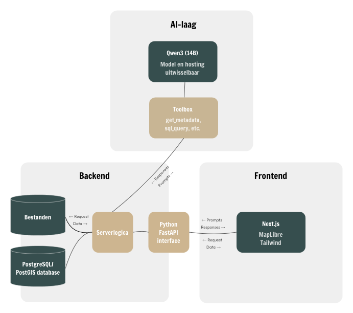

In de vorige post gaven we aan wat meer te schrijven over de tech stack waarmee Gaia is gebouwd. Want hoe iets gebeurt, is net zo goed belangrijk als wat er gebeurt.

Korte recap: Gaia is een applicatie die een LLM combineert met kaartvisualisatie, zodat je ruimtelijke vragen in normale taal kunt stellen.

Voor Gaia willen we zoveel mogelijk open-sourcetechnologie gebruiken. Met open-source ben je niet afhankelijk van de eigenaar van de code (want die is er niet) en kun je altijd achterhalen wat er "onder de motorkap" gebeurt. Wel zo fijn: als je een huis bouwt, wil je ook niet dat van de ene op de andere dag de raamkozijnen niet meer passen, of dat je maandelijks moet gaan betalen voor je gordijnen.

Een applicatie bestaat vaak uit 3 hoofdcomponenten: de frontend (wat de gebruiker ziet), de backend (die gegevens verwerkt) en de database (waar de data wordt opgeslagen).

De frontend van Gaia is ontwikkeld met Next.js, waarbij we Tailwind CSS gebruiken voor het stylen. Voor de interactieve kaart gebruiken we MapLibre.

De backend is volledig geschreven in Python, met FastAPI als framework. 

De database: PostgreSQL met PostGIS voor geodata.

We gebruiken Docker om deze componenten te verpakken en te draaien.

Dan het AI-deel. We gebruiken LangChain + LangGraph voor de taalmodel-workflows. Met deze twee libraries heb je in no-time een AI agent draaien, die je afgebakende taken kan laten uitvoeren. Prompts sturen we naar de servers van OpenRouter. Lokaal een taalmodel draaien is mogelijk — bijvoorbeeld met Ollama, maar een eigen server hiervoor opzetten is ingewikkeld en duur voor kleinschalig gebruik. Voor nu dus OpenRouter, maar dat is goed vervangbaar.

We gebruiken het publiek beschikbare Qwen3-model (14B parameters): een relatief compact model dat goed omgaat met zowel smalltalk als ruimtelijke vragen.

Voor de demovariant van Gaia is het gebruik van OpenRouter geen direct risico, zolang de gebruiker dit weet en geen gevoelige informatie deelt.

Ideeen, vragen of suggesties voor Gaia? Of zou je graag willen samenwerken? Stuur één van ons een berichtje!